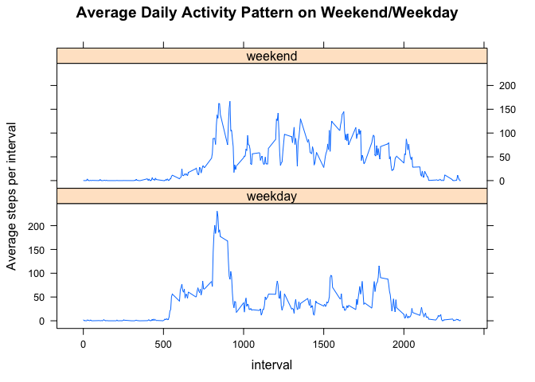

# Reproducible Research: Peer Assessment 1

### Introduction

It is now possible to collect a large amount of data about personal movement using activity monitoring devices such as a Fitbit, Nike Fuelband, or Jawbone Up. These type of devices are part of the “quantified self” movement – a group of enthusiasts who take measurements about themselves regularly to improve their health, to find patterns in their behavior, or because they are tech geeks. But these data remain under-utilized both because the raw data are hard to obtain and there is a lack of statistical methods and software for processing and interpreting the data.

This assignment makes use of data from a personal activity monitoring device. This device collects data at 5 minute intervals through out the day. The data consists of two months of data from an anonymous individual collected during the months of October and November, 2012 and include the number of steps taken in 5 minute intervals each day.


Dataset: Activity monitoring data [52K]

The variables included in this dataset are:

- steps: Number of steps taking in a 5-minute interval (missing values are coded as NA)

- date: The date on which the measurement was taken in YYYY-MM-DD format

- interval: Identifier for the 5-minute interval in which measurement was taken

- The dataset is stored in a comma-separated-value (CSV) file and there are a total of 17,568 observations in this dataset.


###Loading and preprocessing the data

```r
library(dplyr)

read.csv("activity.csv")-> activity
transform(activity,date = as.Date(date)) -> activity
```

###What is mean total number of steps taken per day?
1. Calculate total number of steps per day and make histogram

```r
activity%>%group_by(date)%>%summarize(total_steps = sum(steps)) -> sum_steps_per_day
hist(sum_steps_per_day$total_steps,breaks=20,xlab="total steps per day",main="Histogram: total steps per day")
```


2. Mean and median of total number of steps per day

```r
mean(sum_steps_per_day$total_steps,na.rm=TRUE)
```

```
## [1] 10766.19
```

```r
median(sum_steps_per_day$total_steps,na.rm=TRUE)
```

```
## [1] 10765
```

###What is the average daily activity pattern?
1. Time series plot of the 5-minute interval and the average number of steps taken, averaged across all days

```r
activity%>%group_by(interval)%>%summarize(average_steps = mean(steps,na.rm=TRUE)) -> mean_steps_per_interval
with(mean_steps_per_interval,plot(interval,average_steps,type="l",ylab="Average steps per interval",main="Average Daily Activity Pattern"))
```


2. Which time interval has the max number of steps?

```r
which.max(mean_steps_per_interval$average_steps)
```

```
## [1] 104
```

###Imputing missing values
1. Number of missing values

```r
length(activity$steps[is.na(activity$steps)])
```

```
## [1] 2304
```

2. Inpute missing values

(Inputing strategy: for each 5-minute interval that has NA values, I use the mean for that 5-minute interval across all days)

```r
activity$interval[is.na(activity$steps)]-> na.interval

get_mean_step<-function(interval){
  mean_steps_per_interval$average_steps[mean_steps_per_interval$interval==interval]
}

activity_fixed <- activity
activity_fixed$steps[is.na(activity$steps)]<-sapply(na.interval,get_mean_step)
```

3. With the new data, calculate total number of steps per day and make histogram

```r
activity_fixed%>%group_by(date)%>%summarize(total_steps = sum(steps)) -> sum_steps_per_day_fixed
hist(sum_steps_per_day_fixed$total_steps,breaks=20,xlab="total steps per day",main="Histogram: total steps per day (missing value imputed)")
```


4. Mean and median of total number of steps per day

```r
mean(sum_steps_per_day_fixed$total_steps)
```

```
## [1] 10766.19
```

```r
median(sum_steps_per_day_fixed$total_steps)
```

```
## [1] 10766.19
```

###Are there differences in activity patterns between weekdays and weekends?
1. Label the data by weekday/weekend

```r
dayofweek <-function(weekday){
  if(weekday=="Saturday"||weekday=="Sunday"){
    day = "weekend"
  }else{day="weekday"}
  day
}
activity_fixed$dayofweek<- sapply(weekdays(activity_fixed$date),dayofweek)
activity_fixed<-transform(activity_fixed,dayofweek=as.factor(dayofweek))
```

2. Calculate average steps for each time interval across weekday and weekend, and make the plot

```r
mean_steps_day_of_week<-activity_fixed%>%group_by(dayofweek,interval)%>%summarize(average_steps = mean(steps))

library(lattice)
xyplot(average_steps~interval|dayofweek,data = mean_steps_day_of_week,layout = c(1,2),type="l",ylab="Average steps per interval",main="Average Daily Activity Pattern on Weekend/Weekday")
```


